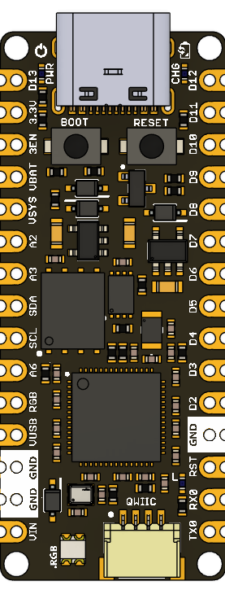

We are currently working on the design of this new development board, **UNIT PULSAR RP2350A**, at UNIT Electronics.  
This compact NANO-format board is based on the **RP230A** microcontroller and is part of the PULSAR series — designed for rapid prototyping, embedded systems education, and low-power applications.

Stay tuned for upcoming updates, including schematics, documentation, and hardware files.  
Our goal is to provide comprehensive resources that support your development process with the UNIT PULSAR RP2350A.

---

For more details and updates, make sure to follow this repository and check back regularly!

## License

This project is licensed under the **MIT License**.  
For more details, please refer to the [LICENSE](./LICENSE) file in this repository.

