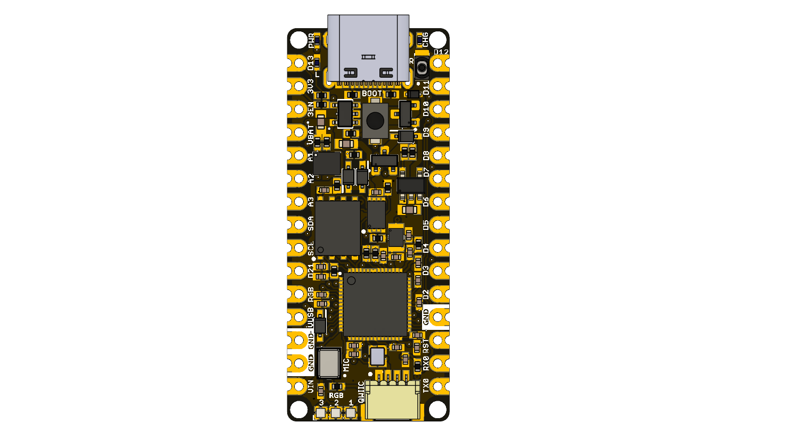

# DevLab: PULSAR RP2350A Development Board

The DevLab PULSAR RP2350A is a multi-interface development board based on the
Raspberry Pi RP2350A microcontroller. The preview V1.3 hardware integrates
external QSPI flash and PSRAM, motion sensing, PDM audio, microSD storage,
addressable RGB indicators, USB-C, QWIIC I²C, battery support, and a 22-pin
HSTX expansion connector.

  
  
<em>DevLab PULSAR RP2350A Development Board</em>

### Quick Setup

## Overview

| Feature | Description |
|---|---|
| Microcontroller | Raspberry Pi RP2350A |
| Program Memory | W25Q128JVPIQ 128 Mbit (16 MiB) QSPI flash |
| External Memory | APS6404L-3SQR-ZR 8 MiB PSRAM |
| Motion Sensor | BMI270 six-axis IMU |
| Audio Input | ICS-41350 digital PDM microphone |
| Storage | 47309-2651 microSD holder on a four-bit SDIO connection |
| Indicators | Three WS2812-compatible RGB LEDs, user LED, power LED, and charge LED |
| Connections | USB-C, QWIIC I²C, battery, SWD, edge pads, and 22-pin HSTX connector |
| Hardware Revision | V1.3.0 artwork |
| Manufacturer Part Number | UE0103 |

## Applications

- **Firmware Development:** RP2350 application and peripheral prototyping.
- **Data Logging:** Motion, audio, and sensor acquisition with microSD storage.
- **Embedded Graphics:** HSTX display and video experiments.
- **External Memory:** Large-buffer prototypes using the onboard PSRAM.
- **Education:** Digital I/O, ADC, I²C, SDIO, PDM, and multicore learning.

## Resources

- [Schematic Diagram](https://github.com/UNIT-Electronics-MX/unit_pulsar_rp2350a/blob/main/hardware/unit_sch_v_1_3_0_pulsar_rp2350a.pdf)
- [Pinout Diagram](https://github.com/UNIT-Electronics-MX/unit_pulsar_rp2350a/blob/main/hardware/README.md#pinout)
- [Getting Started Guide](https://github.com/UNIT-Electronics-MX/unit_pulsar_rp2350a/wiki/0-Getting-Started)
- [C++ Examples](https://github.com/UNIT-Electronics-MX/unit_pulsar_rp2350a/tree/main/software/cpp_examples)

## 📝 License

All hardware and documentation in this project are licensed under the **MIT
License**. See the [repository license](https://github.com/UNIT-Electronics-MX/unit_pulsar_rp2350a/blob/main/LICENSE)
for details. Third-party reference files may have separate terms.

  Template created by UNIT Electronics

> **Note of Development:**
> The V1.3 hardware design is complete and awaiting fabrication; the
> documentation remains in preview. Electrical limits, mechanical dimensions,
> connector orientation, and wiki examples will be confirmed on the first
> manufactured units. The V1.3 source package identifies the
> RP2350A, while the available schematic title block still says `PULSAR RP230A`
> and revision `1.0.0`; this document-control inconsistency is pending correction.
