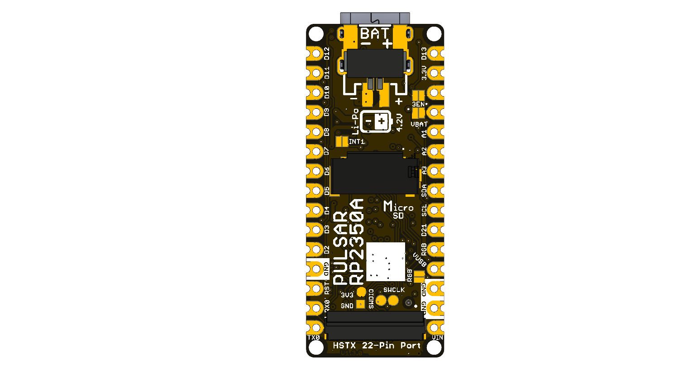

# UNIT PULSAR RP2350 Hardware

## Hardware Scope

This hardware reference covers hardware revision V1.3.0 and its schematic. It
separates design-defined connections from values not specified by the available
board-level documentation. The board uses an RP2350A controller; the schematic
title block says `PULSAR RP230A` and `REV: 1.0.0`.

## Naming Rules

- Product name: **UNIT PULSAR RP2350 Multi-Interface Development Board**.
- Product family: **UNIT DevLab ecosystem**; `DevLab` is not part of the
  product name.
- Source assets use lowercase, descriptive names and explicit
  revisions, for example `unit_top_v_1_3_0_pulsar_rp2350a.png`.
- Generated Product Reference files use
  `unit_product_reference_v_0_1_0_pulsar_rp2350a.*`.

## Hardware

| RefDes | Component | Confirmed role |
|---|---|---|
| IC3 | RP2350A | Main microcontroller |
| IC1 | W25Q128JVPIQ | 128 Mbit (16 MiB) QSPI flash |
| IC4 | APS6404L-3SQR-ZR | 8 MiB PSRAM |
| IC5 | BMI270 | Six-axis IMU on the internal I2C bus |
| MK1 | ICS-41350 | Digital PDM microphone |
| U1 | AP2112K-3.3TRG1 | Fixed 3.3 V LDO |
| IC2 | MCP73831T-2ACI/OT | Single-cell Li-Ion/Li-Polymer charge controller |
| MICRO_SD-HOLDER | 47309-2651 | microSD socket on four-bit SDIO signals |
| LED1–LED3 | WS2812 1010 | Cascaded addressable RGB LEDs |
| J1 | HCZZ0032-4 | Four-position, 1 mm QWIIC-style connector |
| J5 | FH34SRJ-22S-0.5SH(50) | 22-position, 0.5 mm HSTX expansion connector |
| JP1 | PH2.0 2P | Two-position battery connection |

Individual component ratings are not module ratings. In particular, the allowed
`VIN`, `VBAT`, and 3.3 V rail loads are not specified at module level.




## Pinout

The following mapping is transcribed from the V1.3 schematic and visible board
labels. `D8` and `D9` appear on the board but are not traced to RP2350A GPIOs
in the available schematic; treat them as unassigned.

| Board label | RP2350A connection | Function / status |
|---|---|---|
| `TX0` / `D1` | GPIO18 | UART-capable digital I/O |
| `RX0` / `D0` | GPIO19 | UART-capable digital I/O |
| `D2` | GPIO17 | Digital I/O; HSTX connector signal |
| `D3` | GPIO16 | Digital I/O; HSTX connector signal |
| `D4` | GPIO15 | Digital I/O; HSTX connector signal |
| `D5` | GPIO14 | Digital I/O; HSTX connector signal |
| `D6` | GPIO13 | Digital I/O; HSTX connector signal |
| `D7` | GPIO12 | Digital I/O; HSTX connector signal |
| `D8`, `D9` | Not specified | No RP2350A connection shown in the V1.3 schematic |
| `D10` / `SS` | GPIO21 | Digital I/O |
| `D11` / `MOSI` | GPIO22 | Digital I/O |
| `D12` / `MISO` | GPIO23 | Digital I/O |
| `D13` / `SCK` / LED | GPIO20 | Digital I/O and BUILTIN1 indicator |
| `A1` / `D15` | GPIO29 / ADC3 | Analog-capable digital I/O |
| `A2` / `D16` | GPIO27 / ADC1 | Analog-capable digital I/O |
| `A3` / `D17` | GPIO26 / ADC0 | Analog-capable digital I/O |
| `SDA` / `D18` | GPIO8 | Internal/user I2C data; BMI270 bus |
| `SCL` / `D19` | GPIO9 | Internal/user I2C clock; BMI270 bus |
| `D21` | GPIO10 | PDM microphone clock net (`CLK_MIC`) |
| `RGB` | GPIO1 | WS2812 chain data (`NEOP_DO`) |
| `3V3` | 3.3 V rail | Regulated rail; available current not specified |
| `3EN` | LDO enable | Pulled up in the schematic |
| `VBAT` | Battery rail | Operating limits not specified |
| `VUSB` | USB VBUS | USB-C supply rail |
| `VIN` | System supply input | Allowed input range not specified |
| `RST` | Reset | RP2350A reset control |
| `GND` | Ground | Common return |

### Onboard Fixed Connections

| Subsystem | RP2350A GPIO / bus |
|---|---|
| PSRAM chip select | GPIO0 |
| microSD CLK, CMD, DAT0–DAT3 | GPIO2, GPIO3, GPIO4, GPIO5, GPIO6, GPIO7 |
| PDM microphone CLK, DATA | GPIO10, GPIO11 |
| QWIIC SDA, SCL | GPIO24, GPIO25 |
| BMI270 SDA, SCL | GPIO8, GPIO9 |
| W25Q128 QSPI flash | Dedicated QSPI interface |

## Dimensions

A controlled dimension drawing and mounting-hole coordinates are not present
in the supplied V1.3 package. Do not derive dimensions from the rendered board
images.

## Topology

```text
USB-C / VIN / battery
          |
   power and charging
          |
        3.3 V
          |
       RP2350A
   +------+------+------+-------+-------+
   |      |      |      |       |       |
 QSPI   PSRAM  SDIO    I2C     PDM    GPIO/HSTX
 flash          |      BMI270   mic    + QWIIC
              microSD
```

The diagram shows functional relationships only; it is not an electrical
power-path specification.

## Pin & Connector Layout

- **USB-C:** USB data and nominal USB VBUS entry.
- **J1 QWIIC:** four positions carrying GND, 3.3 V, GPIO24/SDA, and
  GPIO25/SCL. Cable orientation is not specified by a controlled drawing.
- **J5 HSTX:** 22-position FFC/FPC connector exposing D0–D7, A0, A1,
  GPIO24/SDA, GPIO25/SCL, 3.3 V, and return pins according to the schematic.
  A complete pin-number table is not included in the technical documentation.
- **microSD:** four-bit SDIO connection (CLK, CMD, DAT0–DAT3).
- **JP1 battery:** two-position battery connector; polarity is shown on the
  bottom side. Compatible batteries and cables are not specified.
- **SWD pads:** `SWDIO`, `SWCLK`, 3.3 V, and GND test/programming pads are
  visible on the bottom side.

## Functional Description

The RP2350A boots from the external W25Q128 QSPI flash. APS6404L PSRAM is
connected to GPIO0 and the QSPI data/clock nets shown in the schematic. The
BMI270 uses the GPIO8/GPIO9 I2C bus; the separate QWIIC connector uses
GPIO24/GPIO25. The microSD socket is wired for four-bit SDIO. The ICS-41350
provides onboard PDM audio on GPIO10/GPIO11. Three WS2812-compatible LEDs form
a chain driven from GPIO1.

USB VBUS and `VIN` feed the documented power-path components, while an
MCP73831 charge controller and external battery connection support a
single-cell battery design. Module-level input ranges, charge current, rail
current, and source-selection behavior are not specified at module level.

## Applications

- Embedded control and peripheral evaluation
- Motion and audio data acquisition
- microSD data logging
- HSTX graphics and display experiments
- RP2350 memory and multicore development
- I2C sensor integration through QWIIC

## References

- [UNIT PULSAR RP2350 repository](https://github.com/UNIT-Electronics-MX/unit_pulsar_rp2350a)
- [Technical wiki](https://github.com/UNIT-Electronics-MX/unit_pulsar_rp2350a/wiki)
- [C++ examples](https://github.com/UNIT-Electronics-MX/unit_pulsar_rp2350a/tree/main/software/cpp_examples)
- [Official RP2350 datasheet](https://datasheets.raspberrypi.com/rp2350/rp2350-datasheet.pdf)
- [Product Reference](https://unit-electronics-mx.github.io/unit_pulsar_rp2350a/hardware/unit_product_reference_v_0_1_0_pulsar_rp2350a.pdf)
- [V1.3 schematic](https://github.com/UNIT-Electronics-MX/unit_pulsar_rp2350a/blob/main/hardware/unit_sch_v_1_3_0_pulsar_rp2350a.pdf)
